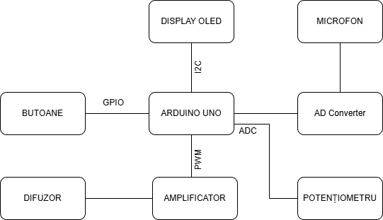

<h1 align="center"><strong>STETOSCOP DIGITAL</strong></h1>

<table width="100%">
<tr>
<td align="left"><strong>Manea Ștefania-Delia</strong></td>
<td align="right"><strong>Grupa 335CC</strong></td>
</tr>
</table>

 

 
## *Introducere*

Proiectul propune realizarea unui stetoscop digital, capabil să capteze sunetele corpului uman prin intermediul unui microfon de înaltă sensibilitate. Utilizatorul va putea începe sau opri înregistrarea prin intermediul unui buton, iar starea va fi indicată de un led aprins verde dacă este pornită sau roșu altfel. Cât timp înregistrarea este pornită, pe ecranul OLED va fi afișată reprezentarea grafică a semnalului captat de microfon.

Semnalul audio va fi amplificat și filtrat utilizând configurații specifice de filtre, în scopul îmbunătățirii clarității și calității sunetelor percepute. Redarea sunetului se va realiza printr-un difuzor conectat la un amplificator audio, iar volumul va putea fi ajustat cu ajutorul unui potențiometru rotativ.

## *Descriere generală*

Arduino Nano reprezintă centrul de control al proiectului, ocupându-se de colectarea datelor, procesarea semnalelor și gestionarea interfeței cu utilizatorul. La acesta sunt conectate următoarele module:

+ **Microfon MAX4466** – Captează sunetele produse de corpul uman. Semnalul analogic generat este trimis către un pin ADC al microcontrollerului, unde este amplificat și pregătit pentru procesare.
+ **Amplificator audio PAM8403** – Primește semnalul audio procesat și îl amplifică pentru a fi redat cu claritate. Este conectat la un difuzor de 3 W, ce redă sunetul în timp real.
+ **Difuzor miniatural** – Conectat la ieșirea amplificatorului, asigură redarea clară a sunetelor auscultate.
+ **Ecran OLED** – Afișează tipul de ascultare selectat (ex: cardiac, pulmonar) și alte informații relevante.
+ **Potențiometru rotativ** – Permite ajustarea manuală a volumului. Semnalul său analogic este citit de Arduino printr-un pin ADC.
+ **Butoane** – Folosite pentru pornirea/oprirea înregistrării. Semnalele digitale de la butoane sunt interpretate de Arduino pentru a schimba comportamentul sistemului și afișajul.
+ **LED RGB** - Indică în ce stare se află înregistrarea.
+ **Modul Convertor AD/DA PCF8591** - Conectat la microfon pentru a converti semnalul captat de acesta din analogic în digital, astfel încât să fie o redare fidelă a sunetului.

 

 

## *Hardware Design*

**Listă de piese:**

+ Arduino Nano
+ Modul microfon MAX4466 cu amplificare si castig reglabil
+ Modul Convertor AD/DA PCF8591
+ Modul Mini Amplificator in Clasa D Stereo PAM8403 de 3 W
+ Difuzor Mini, 3 Wati
+ Ecran OLED 0.96”
+ Potențiometru rotativ
+ Butoane
+ LED RGB
+ Rezistențe de 5k1 Ohm

