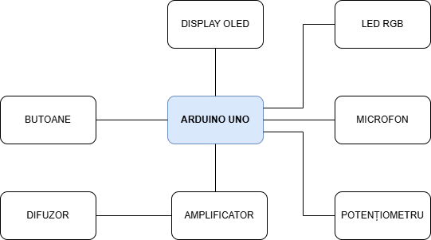
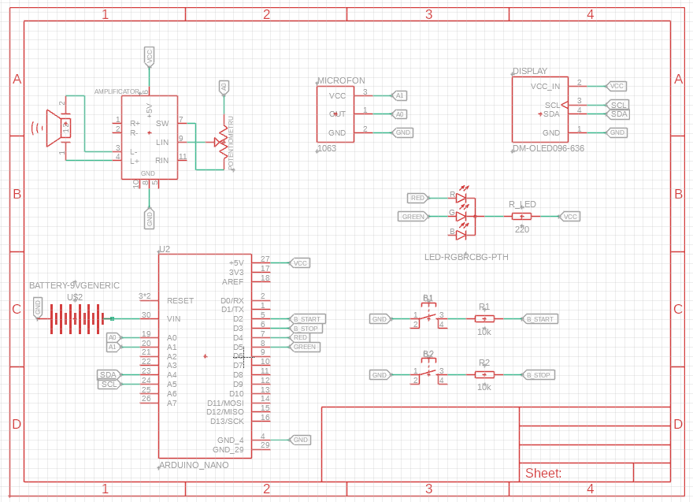
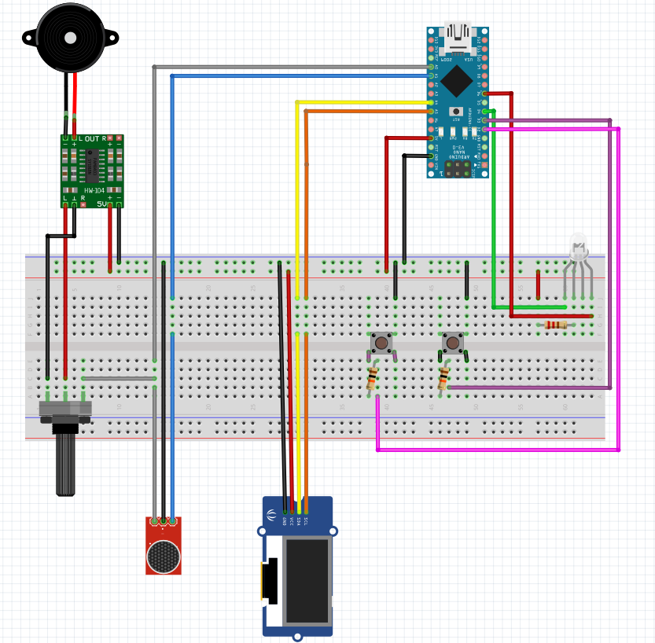
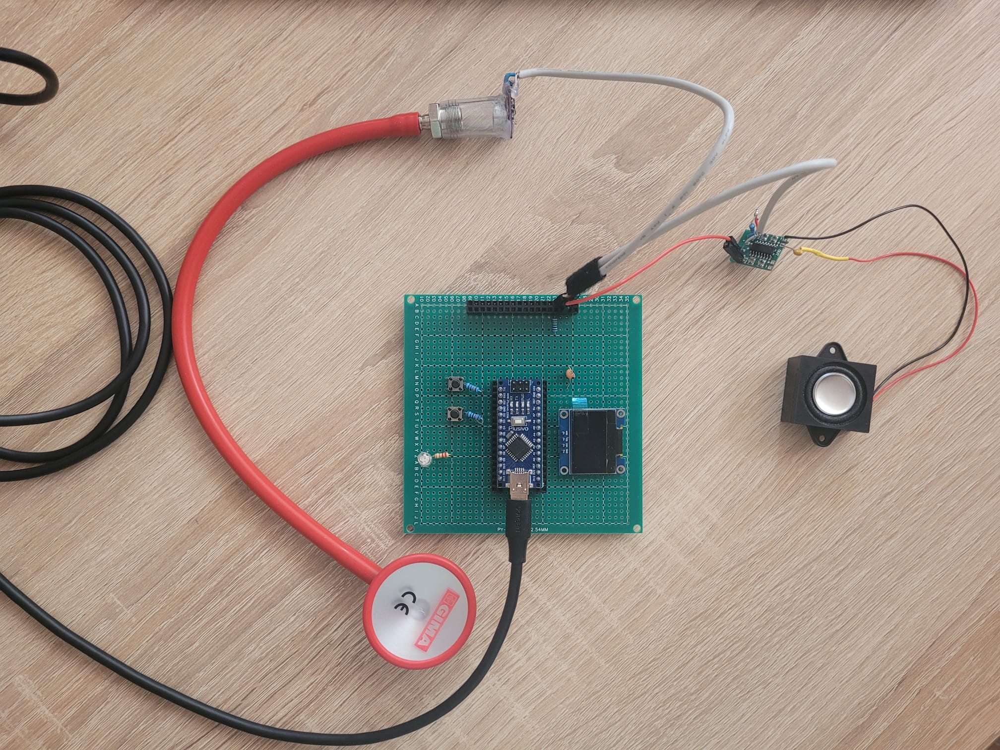
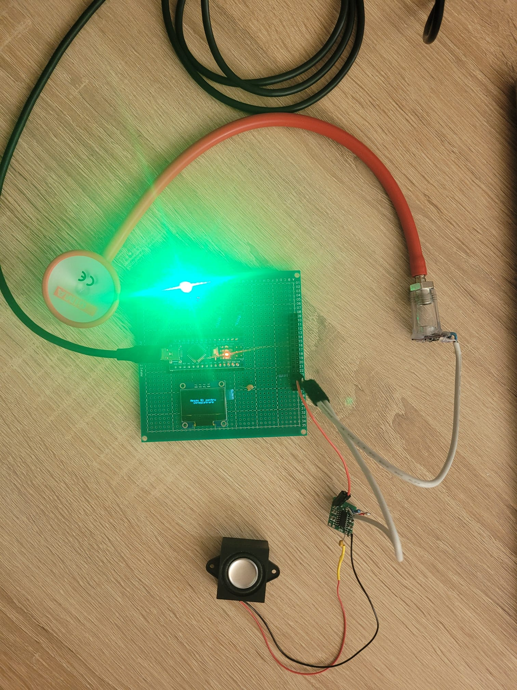
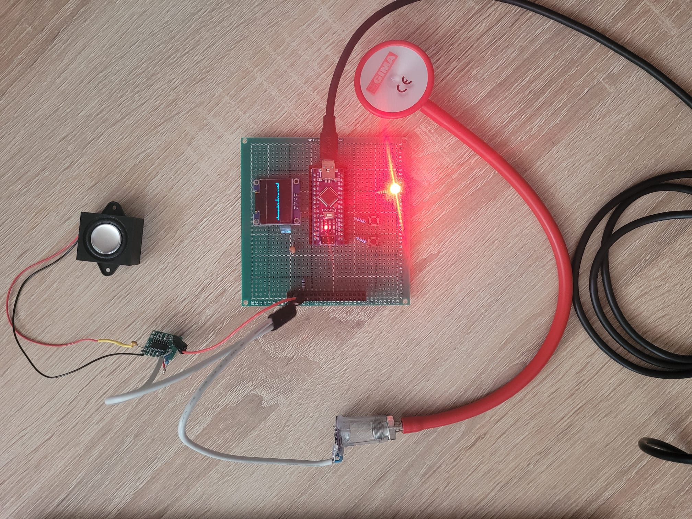
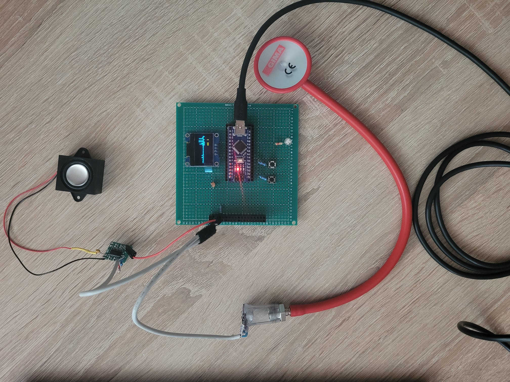

<h1 align="center"><strong>STETOSCOP DIGITAL</strong></h1>

<table width="100%">
<tr>
<td align="left"><strong>Manea Ștefania-Delia</strong></td>
<td align="right"><strong>Grupa 335CC</strong></td>
</tr>
</table>

 

 
## *Introducere*

Proiectul propune realizarea unui stetoscop digital, capabil să capteze sunetele corpului uman prin intermediul unui microfon de înaltă sensibilitate. Utilizatorul va putea începe sau opri înregistrarea prin intermediul unui buton, iar starea va fi indicată de un led aprins verde dacă este pornită sau roșu altfel. Cât timp înregistrarea este pornită, pe ecranul OLED va fi afișată reprezentarea grafică a semnalului captat de microfon.

Semnalul audio va fi amplificat și filtrat utilizând configurații specifice de filtre, în scopul îmbunătățirii clarității și calității sunetelor percepute. Redarea sunetului se va realiza printr-un difuzor conectat la un amplificator audio, iar volumul va putea fi ajustat cu ajutorul unui potențiometru rotativ.

## *Descriere generală*

Arduino Nano reprezintă centrul de control al proiectului, ocupându-se de colectarea datelor, procesarea semnalelor și gestionarea interfeței cu utilizatorul. La acesta sunt conectate următoarele module:

+ **Microfon MAX4466** – Captează sunetele produse de corpul uman. Semnalul analogic generat este trimis către un pin ADC al microcontrollerului, unde este amplificat și pregătit pentru procesare.
+ **Amplificator audio PAM8403** – Primește semnalul audio procesat și îl amplifică pentru a fi redat cu claritate. Este conectat la un difuzor de 3 W, ce redă sunetul în timp real.
+ **Difuzor miniatural** – Conectat la ieșirea amplificatorului, asigură redarea clară a sunetelor auscultate.
+ **Ecran OLED** – Afișează tipul de ascultare selectat (ex: cardiac, pulmonar) și alte informații relevante.
+ **Potențiometru rotativ** – Permite ajustarea manuală a volumului. Semnalul său analogic este citit de Arduino printr-un pin ADC.
+ **Butoane** – Folosite pentru pornirea/oprirea înregistrării. Semnalele digitale de la butoane sunt interpretate de Arduino pentru a schimba comportamentul sistemului și afișajul.
+ **LED RGB** - Indică în ce stare se află înregistrarea.

 

 

## *Hardware Design*

**Funcționalitatea generală HW**
Sistemul hardware este format dintr-un `microfon MAX4466` care captează sunetul din mediu și trimite semnalul analogic rezultat către `Arduino Nano pe pinul A0` pentru analiză și afișare. Microfonul este alimentat la 5V și GND. Afișajul OLED afișează în timp real forma de undă a semnalului audio, fiind conectat la pinii `A4 (SDA) și A5 (SCL)` ai Arduino-ului prin `protocol I²C`. Arduino Nano funcționează ca unitate centrală de control, citind semnalul de la microfon, gestionând afișajul, LED-urile, difuzorul și stările logice ale sistemului. `Două butoane` conectate la `pinii D2 și D3` sunt utilizate pentru a iniția și opri înregistrarea, fiecare fiind conectat la GND prin `rezistențe de pull-down`. Feedback-ul vizual este oferit de un `LED RGB` cu anod comun, al cărui segment verde (pe `D5`) indică starea de repaus, iar segmentul roșu (pe `D4`) pâlpâie în timpul înregistrării. Controlul volumului este realizat printr-un potențiometru montat între ieșirea de semnal și `amplificatorul audio PAM8403`, care reglează tensiunea de intrare și permite ajustarea sunetului perceput în difuzor. Amplificatorul este alimentat la 5V și transmite semnalul audio amplificat către difuzor pentru redare clară.

### `Listă de piese`
+ [Arduino Nano](https://www.optimusdigital.ro/en/compatible-with-arduino-nano/1686-development-board-arduino-nano-compatible-atmega328p-ch340.html?gad_source=1&gad_campaignid=19615979487&gbraid=0AAAAADv-p3BfEEZZl7O_k8PCbMoE1d4yA&gclid=CjwKCAjw_pDBBhBMEiwAmY02Npo2m4ip9HTy-tlA6H_U-An1zd4d-CkBcl3BxZET9_fcyFJ03iXX7xoCEqgQAvD_BwE) 
+ [Modul microfon MAX4466 cu amplificare si castig reglabil](https://sigmanortec.ro/modul-microfon-max4466-cu-amplificare-castig-reglabil-23-5vdc?SubmitCurrency=1&id_currency=2&gad_source=1&gad_campaignid=22174019478&gbraid=0AAAAAC3W72Mtzy7jY3q2IvRJJL2399kKi&gclid=CjwKCAjw_pDBBhBMEiwAmY02NjoiHoMMp2m7MvMgD5IMIKWO3YSxMbl3gWkBP3i0PlqeKFrk4SYHbhoCJd4QAvD_BwE)
+ [Modul Mini Amplificator in Clasa D Stereo PAM8403 de 3 W](https://sigmanortec.ro/modul-amplificator-miniatura-pam8403-22-5v?SubmitCurrency=1&id_currency=2&gad_source=1&gad_campaignid=22174019478&gbraid=0AAAAAC3W72Mtzy7jY3q2IvRJJL2399kKi&gclid=CjwKCAjw_pDBBhBMEiwAmY02Nv4Kh82h7hM4exmOleI9l1nKFCEOkJXp0H4xaOj1xKOyClULKjlmchoCRUEQAvD_BwE)
+ [Difuzor Mini, 3 Wati](https://www.emag.ro/difuzor-mini-3-wati-8-ohmi-pentru-arduino-diy-gd-0135/pd/DSSX18YBM/)
+ [Ecran OLED 0.96”](https://sigmanortec.ro/display-oled-096-i2c-iic-alb?SubmitCurrency=1&id_currency=2&gad_source=1&gad_campaignid=22174019478&gbraid=0AAAAAC3W72Mtzy7jY3q2IvRJJL2399kKi&gclid=CjwKCAjw_pDBBhBMEiwAmY02Nkg1IQK_EUcACBMSpldrDa0FIDTmlGddDwTUg6q6EU_xLhcgTZfY4RoCxKYQAvD_BwE)
+ [Potențiometru rotativ](https://www.optimusdigital.ro/en/potentiometers/1887-100k-mono-potentiometer.html?gad_source=1&gad_campaignid=19615979487&gbraid=0AAAAADv-p3BfEEZZl7O_k8PCbMoE1d4yA&gclid=CjwKCAjw_pDBBhBMEiwAmY02Np0TkkPLCOFwRPMUOY6n5pKcIBN2whddkB2a2r2Mub2G8ekJFebs3BoCaBEQAvD_BwE)
+ [Butoane](https://sigmanortec.ro/buton-mini-6x6x5-4-pini?SubmitCurrency=1&id_currency=2&gad_source=1&gad_campaignid=22174019478&gbraid=0AAAAAC3W72Mtzy7jY3q2IvRJJL2399kKi&gclid=CjwKCAjw_pDBBhBMEiwAmY02NpxfK8MtKIF-iWQKl6GAaAhgb36NExmekoQhD_qB1ldQNoiYYklYBhoCu1EQAvD_BwE)
+ [LED RGB](https://sigmanortec.ro/LED-RGB-5mm-4-pini-Catod-comun-p136284849?SubmitCurrency=1&id_currency=2&gad_source=1&gad_campaignid=22174019478&gbraid=0AAAAAC3W72Mtzy7jY3q2IvRJJL2399kKi&gclid=CjwKCAjw_pDBBhBMEiwAmY02NpXqShHs5yZXH-7NuQuPmsTUzHCgz7o_y7E58lyUDhFF_HLYKFX6AhoCqikQAvD_BwE)
+ [Rezistențe de 5k1 Ohm](https://www.optimusdigital.ro/en/resistors/853-025w-51k-resistor.html)

### `Conectare componente`

| Componentă      | Pin                         | Motivație                                               |
|-----------------|-----------------------------|----------------------------------------------------------|
| Microfon        | A0                          | Folosit pentru afișaj                                    |
| Microfon        | A1                          | Folosit pentru transmitere la difuzor                    |
| Display OLED    | A4 (SDA), A5 (SCL)          | Comunicare I2C Arduino-Display                           |
| Potențiometru   | A0                          | Reglează semnalul primit de la microfon și îl trimite la amplificator |
| Amplificator    | Semnal potențiometru        | Trimite semnal audio amplificat către difuzor            |
| Difuzor         | A1                          | Controlează alimentarea pozitivă a amplificatorului      |
| LED RGB         | D4 (Red), D5 (Green)        | Feedback de stare vizual                                 |
| Buton 1         | D2                          | Start înregistrare                                       |
| Buton 2         | D3                          | Oprire și revenire la starea inițială                    |

 

## *Software Design*

### Flow-ul programului

Programul funcționează pe o mașină de stări (`State currentState = BEGIN/RECORD`), în care logica principală este împărțită în două stări esențiale: **BEGIN** și **RECORD**.

### `Starea BEGIN – Așteptare`

Această stare este activă imediat după pornirea sistemului. În acest moment, dispozitivul se află în repaus și așteaptă interacțiunea utilizatorului. LED-ul roșu este aprins pentru a semnala starea pasivă, iar LED-ul verde este stins. Speaker-ul este dezactivat. Pe ecranul OLED este afișat un mesaj care îi spune utilizatorului cum să înceapă înregistrarea: *Apasă B1 pentru înregistrare*.

La apăsarea butonului 1, sistemul inițiază tranziția către starea de înregistrare (**RECORD**). În acest moment sunt resetate variabilele relevante: `beatCount` este setat la 0, iar `beatDetected` este resetat pentru a permite o detecție corectă a următoarelor bătăi. Se pornește cronometrul intern (`recordStartTime = time_millies()`), iar ecranul este curățat pentru a începe afișarea semnalului cardiac.

### `Starea RECORD – Înregistrare activă`

În această stare, dispozitivul începe efectiv procesul de monitorizare a bătăilor inimii. LED-ul verde este stins, în timp ce LED-ul roșu clipește la fiecare 500ms, indicând activitatea înregistrării.

În bucla principală a acestei stări, sistemul citește valoarea analogică de la microfonul conectat pe pinul ADC0. Această valoare este convertită într-o poziție verticală `y`, utilizată pentru desenarea unui grafic asemănător unei electrocardiograme. Dacă valoarea semnalului depășește pragul `PEAK_THRESHOLD`, sistemul consideră că a fost detectată o bătaie a inimii și incrementează `beatCount`, cu condiția să nu fi fost deja detectată o bătaie în momentul anterior (evitând astfel detecțiile duble).

Semnalul este desenat în timp real pe display, iar coloanele sunt curățate și desenate continuu.

### Condiție de oprire

Înregistrarea poate fi oprită prin apăsarea butonului 2. În acest caz, dispozitivul revine în starea **BEGIN**. Speaker-ul este dezactivat, iar sistemul calculează automat durata înregistrării și valoarea ritmului cardiac exprimată în BPM, folosind formulele:

* `duration = (time_millies() - recordStartTime) / 1000`
* `BPM = (beatCount * 60) / duration`

Datele obținute sunt transmise funcției `result_screen(bpm, duration, beatCount)`, care se ocupă de afișarea rezultatelor și animația cu inima care pulsează.

---

## Structura și rolul fiecărui fișier

Proiectul este structurat în mai multe fișiere sursă, fiecare având un rol specific în funcționarea generală a sistemului. În continuare voi descrie în detaliu fiecare fișier:

### `main.cpp` – Fluxul programului și logica de bază

Acesta este punctul de intrare al programului. Are rolul de a inițializa hardware-ul și de a coordona logica programului bazată pe stări.

Apelează funcțiile de inițializare:

* `gpio_init()`, `adc_init()`, `timer0_init()`
* Configurează ecranul OLED cu `display.begin()`
* Rulează o buclă `while(1)` care alternează între două stări:

  * **BEGIN**: Așteaptă butonul 1 pentru a începe înregistrarea.
  * **RECORD**: Citește semnalul de la microfon, detectează bătăi, desenează semnalul pe ecran și calculează BPM la oprirea înregistrării (prin butonul 2).

Gestionează și controlul LED-urilor, speaker-ului și afișarea semnalului de puls.

### `init.hpp` – Inițializarea componentelor hardware

Acest fișier definește funcții pentru a configura perifericele microcontroller-ului.

**Funcții definite:**

* `gpio_init()`

  * Configurează: butoane ca intrări cu pull-up, LED-uri ca ieșiri (inițial stinse), pinul pentru speaker ca ieșire.
* `adc_init()`

  * Configurează ADC-ul pentru citirea de la microfon, cu referință AVCC și prescaler 64.
* `timer0_init()`

  * Inițializează Timer0 în mod CTC pentru a genera o întrerupere la fiecare 1 ms.

### `vars.hpp` – Configurări globale și definiri

Fișierul definește variabile și constante globale necesare în întregul proiect.

**Include:**

* Dimensiunile ecranului OLED: `SCREEN_WIDTH`, `SCREEN_HEIGHT`
* Obiectul global `display` pentru controlul OLED-ului
* Maparea pinilor pentru microfon, LED-uri, butoane și speaker
* Praguri de detecție: `PEAK_THRESHOLD`, `MIC_THRESHOLD`
* Variabila `volatile uint32_t systicks` pentru măsurarea timpului

### `screen.hpp` – Afișare grafică și gestionare LED-uri

Acest fișier conține funcțiile de afișare și de interpretare a rezultatelor măsurării.

**Funcții principale:**

* `ISR(TIMER0_COMPA_vect)` – Rutină de întrerupere la fiecare 1 ms → incrementează `systicks`
* `time_millies()` – Returnează timpul curent în milisecunde
* `begin_screen()` – Afișează ecranul de start
* `result_screen(bpm, duration, beatCount)` – Afișează rezultatele (BPM, durată, număr de bătăi) și o animație cu o inimă pulsantă

Setează LED-urile în funcție de nivelul ritmului cardiac:

* Verde: 60–100 BPM (normal)
* Portocaliu: 40–60 sau 100–120 BPM (alertă moderată)
* Roșu: <40 sau >120 BPM (critic)

### `libs.hpp` – Include-uri și biblioteci

Fișier folosit pentru a centraliza toate bibliotecile necesare.

**Include:**

* AVR:

  * `avr/io.h`, `avr/interrupt.h`, `util/delay.h`, `stdint.h`, `stdbool.h`
* Display OLED:

  * `Wire.h`, `Adafruit_GFX.h`, `Adafruit_SSD1306.h`

### `heart.hpp` – Resurse grafice (bitmap-uri inimă)

Conține două array-uri `PROGMEM` cu bitmap-uri pentru animația inimii:

* `heartSmall[]` – inimă mică
* `heartBig[]` – inimă mare

Acestea sunt desenate alternativ pe ecran în `result_screen()` pentru a simula o inimă care pulsează.

## *Rezultate obținute*
[Demo proiect](https://www.youtube.com/watch?v=QOGykQ_T8kw)

Rezultatele obținute în urma testării arată că proiectul simulează detectarea bătăilor inimii și le contorizează în timp real. Informațiile afișate pe ecranul OLED, mai exact BPM-ul, durata înregistrării și numărul de bătăi, sunt clare și ușor de înțeles, iar animația inimii contribuie la o experiență interactivă și intuitivă pentru utilizator. Aceste elemente fac ca proiectul să fie nu doar funcțional, ci și accesibil și prietenos pentru utilizatori.

|  |  |
| --- | -- |
|  |  |

 

## *Concluzie*

Proiectul Stetoscop Digital pune în evidență un mod practic și eficient de a construi un sistem embedded care răspunde la interacțiuni reale. Utilizarea resurselor hardware precum ADC, GPIO, timer și interfața I2C pentru display-ul OLED a permis construirea unei aplicații care combină interacțiunea fizică (butoane, LED-uri, speaker) cu o interfață grafică intuitivă. Această combinație de componente oferă un rezultat vizual și funcțional.

Codul este clar structurat, iar funcționalitatea este împărțită logic, ceea ce face ca proiectul să fie ușor de înțeles și de testat.

